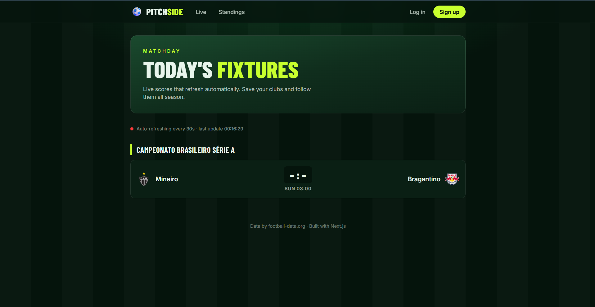
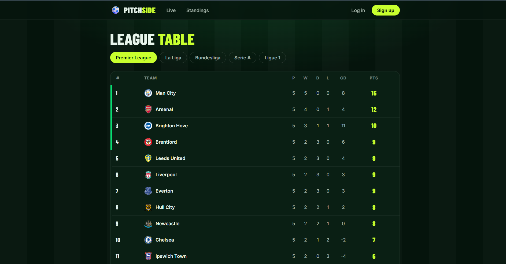

# ⚽ Pitchside: Live Football Tracker

Live scores, league tables, top scorers and saved teams, built with Next.js and PostgreSQL.

**🔗 Live demo:** https://pitchside--live.vercel.app/




## Features

- Live match scores that auto-refresh every 30 seconds
- League tables and top scorers for the Premier League, La Liga, Bundesliga, Serie A and Ligue 1
- Team pages with squad and upcoming fixtures
- Email/password sign-up and login
- Save favourite teams and see their next fixtures on a personal dashboard

## Tech stack

- **Next.js** (App Router, TypeScript) and **Tailwind CSS**
- **PostgreSQL** on Neon
- **football-data.org** API
- Hosted on **Vercel**

## How it works

- The API key stays on the server, and the browser only talks to my own API routes.
- Upstream responses are cached with Next.js `revalidate`, so many visitors share a few API calls.
- Passwords are hashed with bcrypt, and sessions are JWTs in httpOnly cookies.
- All SQL is parameterized.

## Run locally

```bash
git clone https://github.com/ashu260406/sports-tracker.git
cd sports-tracker
npm install
```

Create `.env.local`:

```env
DATABASE_URL=your_postgres_connection_string
FOOTBALL_API_KEY=your_football_data_token
AUTH_SECRET=a_long_random_string
```

Create the tables (see `schema.sql` below), then:

```bash
npm run dev
```

```sql
CREATE TABLE IF NOT EXISTS users (
  id SERIAL PRIMARY KEY,
  email TEXT UNIQUE NOT NULL,
  password_hash TEXT NOT NULL,
  created_at TIMESTAMPTZ DEFAULT now()
);

CREATE TABLE IF NOT EXISTS favorite_teams (
  user_id INT NOT NULL REFERENCES users(id) ON DELETE CASCADE,
  team_id INT NOT NULL,
  team_name TEXT NOT NULL,
  crest TEXT,
  created_at TIMESTAMPTZ DEFAULT now(),
  PRIMARY KEY (user_id, team_id)
);
```

Data provided by [football-data.org](https://www.football-data.org).